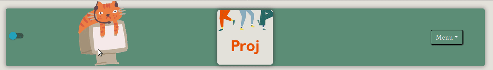
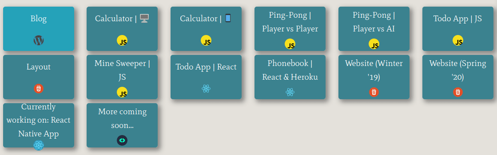
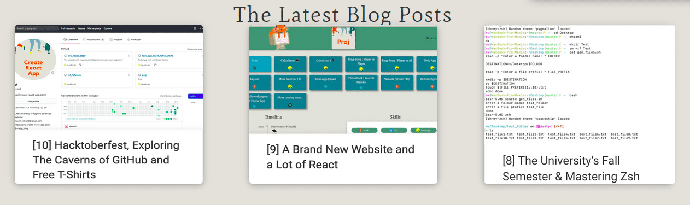
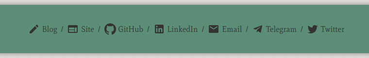

[![Contributors][contributors-shield]][contributors-url]
[![Forks][forks-shield]][forks-url]
[![Stargazers][stars-shield]][stars-url]
[![Issues][issues-shield]][issues-url]

<!-- PROJECT LOGO -->
 

  

  <h3 align="center">Proj_react_2020</h3>

<!-- TABLE OF CONTENTS -->
## Table of Contents

- [Proj](#proj)
    - [Built With](#built-with)
  - [Website](#website)
    - [Blog](#blog)
  - [Road map](#road-map)
  - [Contributing](#contributing)
  - [Contact](#contact)

  

# Proj

* [Proj website](https://proj.create-react-app.com/)
* [Create React App Blog](https://create-react-app.com/)

### Built With

* HTML
* CSS
* JavaScript
* [React](https://reactjs.org/docs/getting-started.html)
* [Material-UI](https://material-ui.com/)
* [Ant Design](https://ant.design/)
* [React Bootstrap](https://react-bootstrap.github.io/)

### Website

[Proj](https://proj.create-react-app.com/)

  

#### Projects

  

#### Blog

[Create React App Blog](https://create-react-app.com/)

  

<!-- ROAD MAP -->
### Road map

See the [open issues](https://github.com/villivald/proj_react_2020/issues) for a list of proposed features (and known issues).

<!-- CONTRIBUTING -->
### Contributing

Contributions are what make the open source community such an amazing place to be learn, inspire, and create. Any contributions you make are **greatly appreciated**.

1. Fork the Project
2. Create your Feature Branch (`git checkout -b feature/AmazingFeature`)
3. Commit your Changes (`git commit -m 'Add some AmazingFeature'`)
4. Push to the Branch (`git push origin feature/AmazingFeature`)
5. Open a Pull Request

### Contact

[https://create-react-app.com/contact/](https://create-react-app.com/contact/)

  

<!-- MARKDOWN LINKS & IMAGES -->
<!-- https://www.markdownguide.org/basic-syntax/#reference-style-links -->
[contributors-shield]: https://img.shields.io/github/contributors/villivald/proj_react_2020.svg?style=flat
[contributors-url]: https://github.com/villivald/proj_react_2020/graphs/contributors
[forks-shield]: https://img.shields.io/github/forks/villivald/proj_react_2020.svg?style=flat
[forks-url]: https://github.com/villivald/proj_react_2020/network/members
[stars-shield]: https://img.shields.io/github/stars/villivald/proj_react_2020.svg?style=flat
[stars-url]: https://github.com/villivald/proj_react_2020/stargazers
[issues-shield]: https://img.shields.io/github/issues/villivald/proj_react_2020.svg?style=flat
[issues-url]: https://github.com/villivald/proj_react_2020/issues
