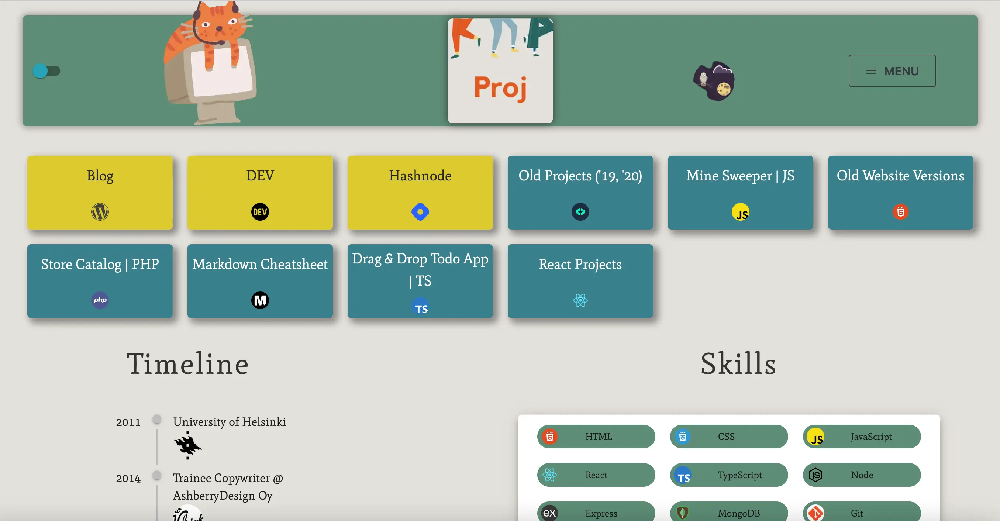
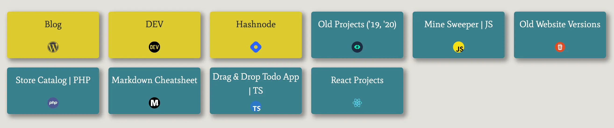
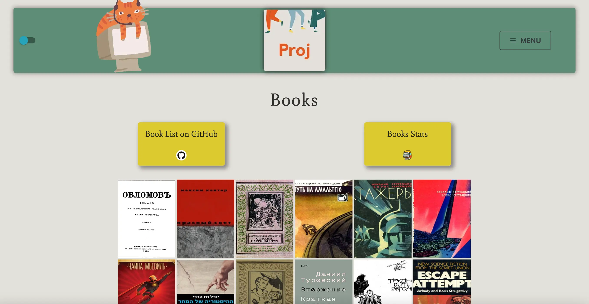
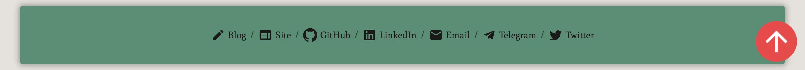

<h1 align="center">Welcome to VILLIVALD.COM 👋</h1>

> The website with my projects built with React

  
  
  
  
  
  
  
  
  
  
  
  
  
  
  

  

# Proj

### 🔥 [Homepage](https://villivald.com/)

### ⚡️ [Blog](https://create-react-app.com)

### Built With

- [React](https://reactjs.org/docs/getting-started.html)
- [TypeScript](https://www.typescriptlang.org/)
- [Material-UI](https://material-ui.com/)
- [Ant Design](https://ant.design/)
- [Mantine](https://mantine.dev/)
- [Framer Motion](https://www.framer.com/motion/)
- [React Grid Gallery](https://benhowell.github.io/react-grid-gallery/)
- [kbar](https://kbar.vercel.app/)

## Website

[Proj](https://villivald.com/)

  

#### Projects

  

#### Uses

  

#### Courses

  

#### Books

  

## Blog

[Create React App Blog](https://create-react-app.com/)

  

## Author

👤 **villivald**

- Website: https://villivald.com/
- Blog: https://create-react-app.com/
- Twitter: [@crapp_blog](https://twitter.com/crapp_blog)
- Github: [@villivald](https://github.com/villivald)
- Dev: [@villivald](https://dev.to/villivald)
- LinkedIn: [@villivald](https://linkedin.com/in/villivald)

## 🤝 Contributing

  

Contributions, issues and feature requests are welcome! Feel free to check [issues page](https://github.com/villivald/proj_react_2020/issues).

## Show your support

Give a ⭐️ if this project helped you!

<!-- MARKDOWN LINKS & IMAGES -->
<!-- https://www.markdownguide.org/basic-syntax/#reference-style-links -->

[contributors-shield]: https://img.shields.io/github/contributors/villivald/proj_react_2020.svg?style=flat
[contributors-url]: https://github.com/villivald/proj_react_2020/graphs/contributors
[forks-shield]: https://img.shields.io/github/forks/villivald/proj_react_2020.svg?style=flat
[forks-url]: https://github.com/villivald/proj_react_2020/network/members
[stars-shield]: https://img.shields.io/github/stars/villivald/proj_react_2020.svg?style=flat
[stars-url]: https://github.com/villivald/proj_react_2020/stargazers
[issues-shield]: https://img.shields.io/github/issues/villivald/proj_react_2020.svg?style=flat
[issues-url]: https://github.com/villivald/proj_react_2020/issues
